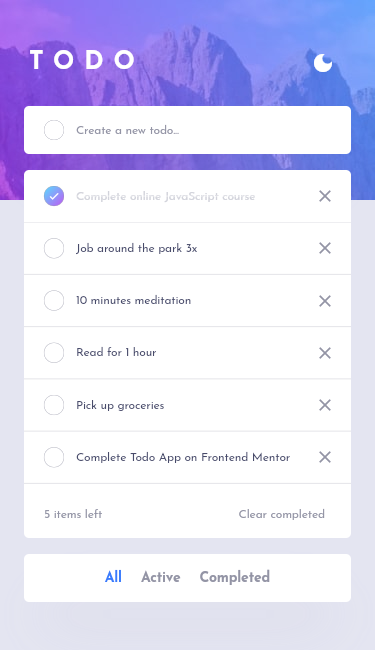
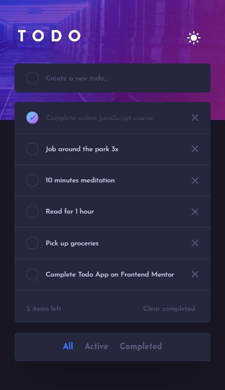

# Frontend Mentor - Todo app solution

This is a solution to the [Todo app challenge on Frontend Mentor](https://www.frontendmentor.io/challenges/todo-app-Su1_KokOW). Frontend Mentor challenges help you improve your coding skills by building realistic projects.

## Table of contents

- [Overview](#overview)
  - [The challenge](#the-challenge)
  - [Screenshot](#screenshot)
  - [Links](#links)
- [My process](#my-process)
  - [Built with](#built-with)
  - [What I learned](#what-i-learned)
  - [Continued development](#continued-development)
  - [Useful resources](#useful-resources)
- [Author](#author)
- [Acknowledgments](#acknowledgments)

## Overview

### The challenge

Users should be able to:

- View the optimal layout for mobile devices
- Add new todos to the list
- Mark todos as complete
- Delete todos from the list
- Filter by all/active/complete todos
- Clear all completed todos
- Toggle light and dark mode

### Screenshot

### Links

- Solution URL: [Solution](https://github.com/JustANipple/todo_app)
- Live Site URL: [Live site](https://todo-app-96af1.web.app/)

## My process

### Built with

- Dart
- Flutter
- Provider
- Firebase

### What I learned

I made the first dynamic app in Flutter, using an MVC structure and Provider to manage widget states
Had a steep learning curve with constraints, but i made it through

### Continued development

Next time i'll manage data through a database

### Useful resources

- [Flutter docs](https://docs.flutter.dev/) - Everything is possible thanks to the Flutter docs

## Author

- Frontend Mentor - [@JustANipple](https://www.frontendmentor.io/profile/JustANipple)
